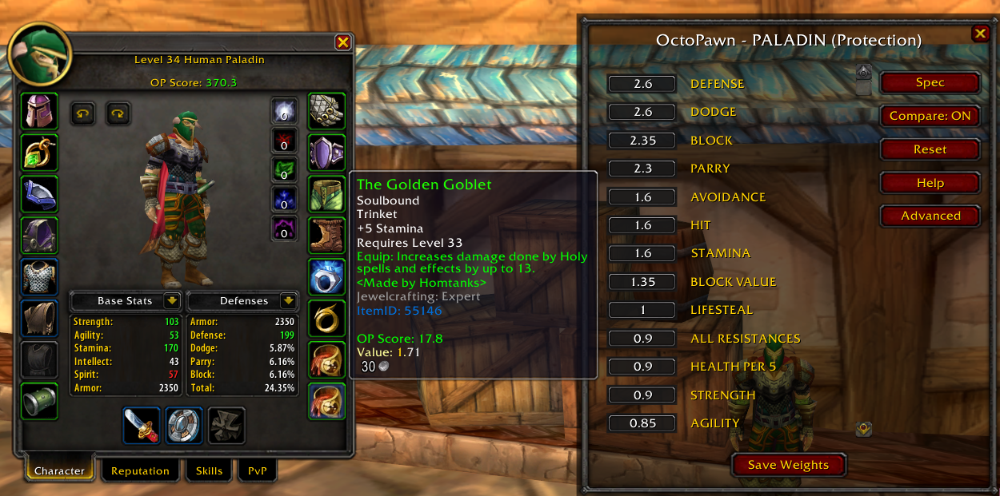

# OctoPawn

A lightweight item scoring and comparison addon built for OctoWoW.

OctoPawn reads the stats on gear and gives you a clear **OP Score** so you can quickly tell whether something is actually an upgrade for your role. It also keeps an always-on equip comparison that shows how the item stacks up against what you already have equipped.

### Features

* **Role-based scoring** – Pre-made weight sets for every class and common role (Arms, Fury, Protection, Holy, Retribution, Balance, Feral Cat/Bear, Restoration, etc.)
* **Immediate OP Score on tooltips** – See the score the moment you mouse over an item
* **Always-on equip comparison** – Automatically compares the hovered item against your currently equipped gear in the same slot(s)
* **Default + fully customizable stat weights** – Start with solid role defaults, then tweak any individual weight to your liking
* **Soft-cap / diminishing returns** – Built-in soft caps for stats like Hit, Spell Hit, Crit, Defense, Dodge, etc. (fully adjustable in the Advanced panel)
* Properly parses a wide range of stats, including things like Spell Hit, Casting Regen, Feral Attack Power, Armor Penetration, and many others
* OP Score shown on your character paperdoll and when inspecting other players
* Minimap button + simple config UI
* Per-character saved settings

### Commands

|Command|What it does|
|-|-|
|`/op`|Score the currently hovered item (+ equipped compare)|
|`/op compare`|Toggle the equip comparison on/off|
|`/op spec`|Open the role / spec picker|
|`/op reset`|Reset weights back to the current role’s defaults|
|`/op help`|Show this help|

You can also open the full config window from the minimap button.

### Installation

1. Place the `OctoPawn` folder into your `Interface/AddOns` directory.
2. Restart the game or type `/reload`.
3. On first load you’ll be prompted to pick a role for your class.

For the OctoLauncher / GitAddonsManager update system to work, install via Git so the `.git` folder is present.

### Notes

This addon is made for OctoWoW’s client and the custom stats that exist on this server. Behavior on other private servers or official clients is not guaranteed.

Free to use and modify under the MIT License.

